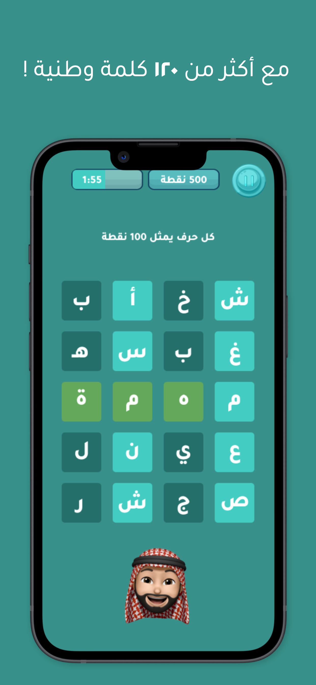

# Watan’s Letters (حروف الوطن)

**Watan’s Letters** is a SwiftUI-based word finder game where players must find 3 Saudi words before time runs out. This game is packaged as a Swift Package Manager (SPM) library for easy integration into your iOS app.

<p align="center">
  
  
  
</p>

## Installing the Package

To install **Watan’s Letters** using Swift Package Manager:

1. In Xcode, select **File > Add Packages**.
2. In the search bar, enter the repository URL:  
   `https://github.com/SadO-On/98s-saudi-national-day-game.git`
3. Choose the **main** branch or the latest version.
4. Click **Add Package**.

Alternatively, you can add **Saudi Letters** directly to your `Package.swift` file:

```swift
dependencies: [
    .package(url: "https://github.com/SadO-On/98s-saudi-national-day-game.git", from: "1.0.0")
]
```

## Using the Package in Your App

After installing the package, you can easily integrate **Watan’s Letters** into your app.

### Import the module:

```swift
import National_day_game_package
```

### Present the game view in your SwiftUI app:

```swift
import SwiftUI
import National_day_game_package

struct ContentView: View {
    @State private var isPresenting = false

    var body: some View {
        Button("Play Game") {
            isPresenting.toggle()
        }
        .fullScreenCover(isPresented: $isPresenting, content: {
            GameStartView(isPresenting: $isPresenting)
        })
    }
}
```
## Accessing Player Level and XP

To access the player’s level and XP, you can use UserDefaults. The key names for retrieving this information are `level` and `xp`. Here’s how you can do it:

### Swift Example

```swift
// Retrieve player level
let playerLevel = UserDefaults.standard.integer(forKey: "level")

// Retrieve player XP
let playerXP = UserDefaults.standard.integer(forKey: "xp")
```

## Compatibility

| Platform | Version |
|----------|---------|
| iOS      | 14.0+   |

This package supports SwiftUI.

## Dependency Resolution

### 1. Versioning:

Our package relies on specific dependencies. If you are using any of them in your project, ensure that you are using the recommended versions mentioned in the table.

| Dependency | Version |
|------------|---------|
| lottie-spm | 4.4.1   |
| UIPilot    | 2.0.2   |

### 2. Conflict Resolution:

In case of version conflicts with existing dependencies in your project, follow these steps:

1. Identify conflicting dependencies.
2. Check our documentation for recommended versions and update conflicting dependencies accordingly.
3. If issues persist, reach out to us for personalized assistance. [Contact us here](https://www.98s.studio/).

## License

This project is licensed under the **MIT License**. See the [LICENSE](./LICENSE) file for more details.

